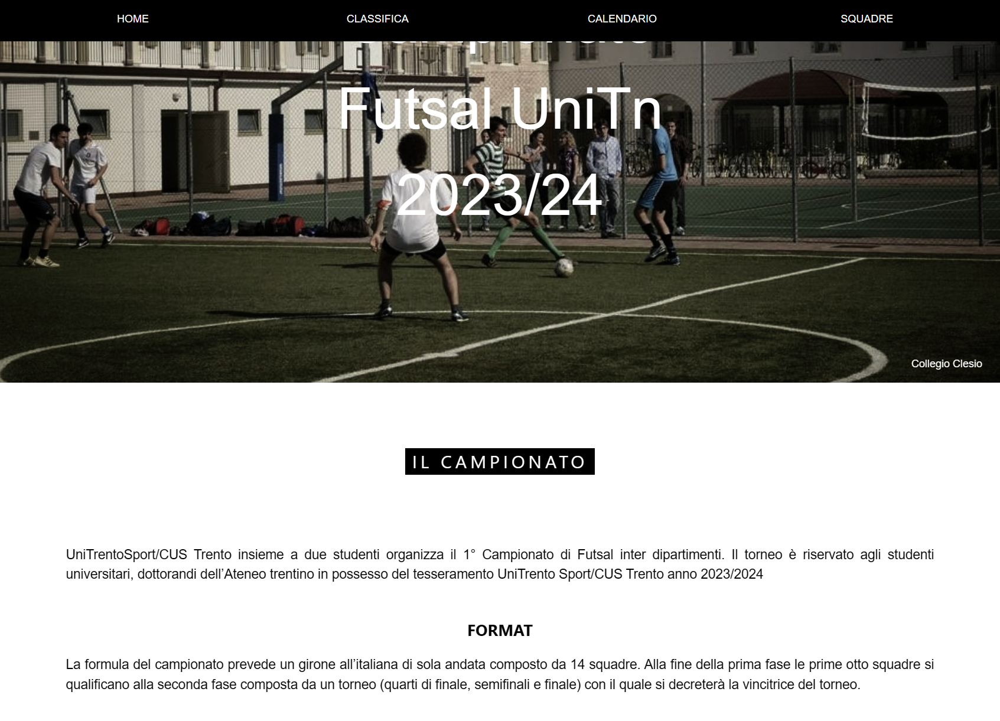
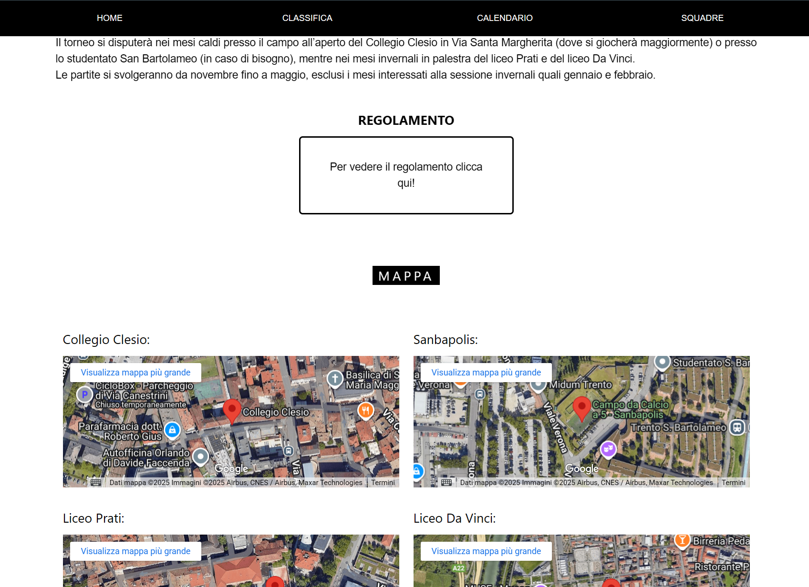

# Futsal-tournament-CusTN
### Project description
I organized a university five-a-side football tournament involving over 1,200 students. The competition featured a group stage followed by knockout rounds; dozens of teams played hundreds of matches. To efficiently manage the event, I developed a dedicated website that tracks match results, standings, and team statistics in real time. 
 Website: <a href="https://campionatounitn.altervista.org/">Campionato UniTn</a>

---

### Website structure
The website development can be divided into two phases, which also reflect my growth as a developer.
#### Phase 1 — Initial Version
The first release was built with HTML, CSS, and JavaScript for the frontend, and PHP for the backend, connected to a MySQL database hosted on Altervista. This setup allowed administrators to insert match results and automatically update standings and statistics. However, every change required a full page reload, making the experience functional but limited.
##### Phase 2 — Modernization
After learning React, I add a new part of the frontend using a <b>component-based structure</b> with TypeScript for better reliability while using and modifying the data. To support it, I created <b>PHP APIs that return JSON</b>, enabling the React app to fetch and display data asynchronously. This made the site faster, more interactive, and easier to maintain.

---
### Design
For the design of the site I used a w3school css template, in order to keep only the essential information and make the site simple to use. 

  

---
### Motivation and History
At my university, there were no structured sporting events dedicated to five-a-side football, despite the strong interest among students. This lack of opportunities created a gap in student life and limited occasions for social interaction through sports.
 I wanted to fill this gap by organizing a large-scale tournament that could bring together students from different faculties, provide a competitive yet enjoyable environment, and set the foundation for future editions of the event.
  To achieve this, I directly contacted the university’s dedicated sports office (CUS) and collaborated with them throughout the entire competition. I managed logistics, planned the rules and schedule, and developed a digital platform to track results and standings in real time.
 The initiative led to the largest sports tournament of the year, with over <strong>1,200 students</strong> involved. The success of the project not only created an engaging and memorable experience for participants but also established the basis for future tournaments, ensuring continuity and growth of student-led sporting activities.
